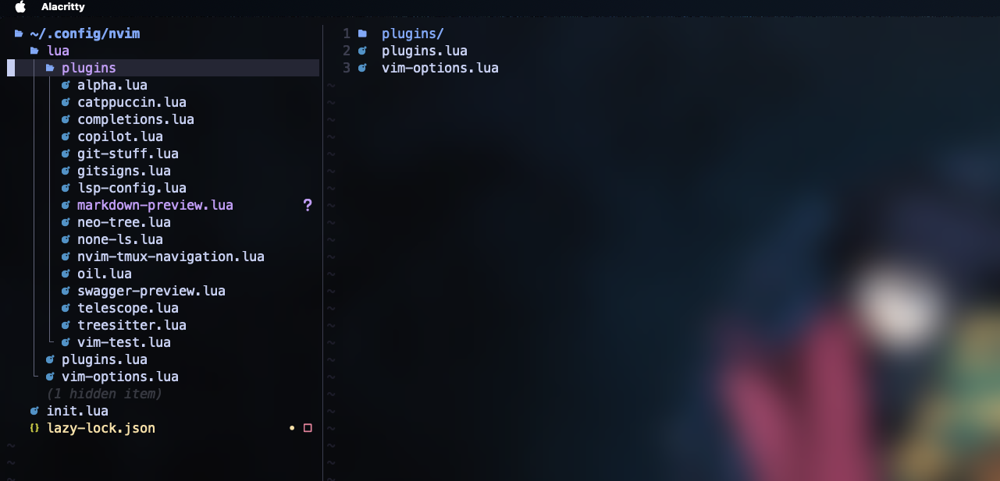

# dotconfigs
My dotfiles and configurations for various programs.
- neovim
- tmux
- alacrittty

## Prerequisites
- neovim
- tmux
- alacritty

## Installation
1. Clone the repository
```bash
git clone https://github.com/shubhindia/dotconfig.git
```
## Preview
- neovim



- code-editor


